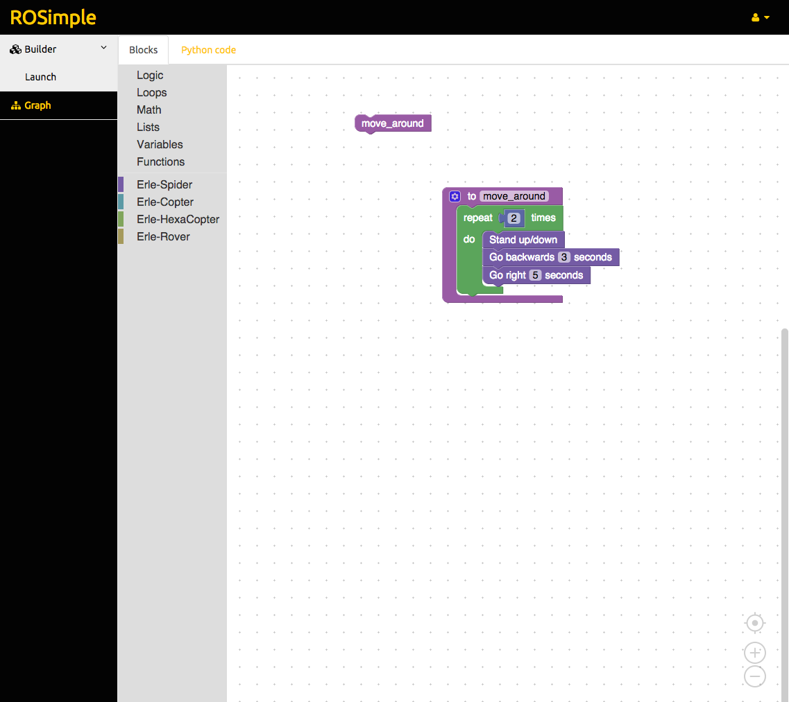
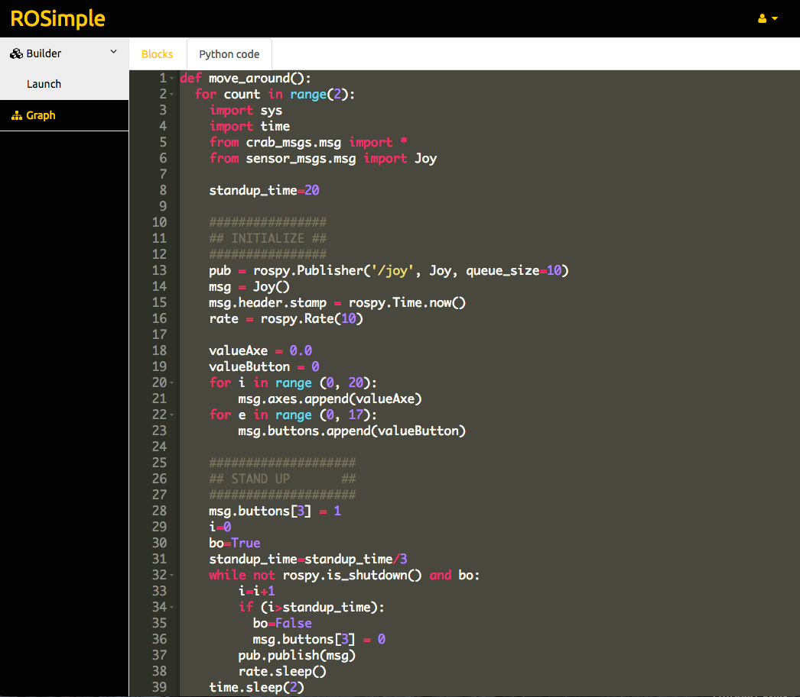

# robot_blockly


`robot_blockly` is a ROS package that provides web-based visualization and block programming tools for robots and drones.




### Installation:

```
mkdir -p ~/blockly_ws/src
cd ~/blockly_ws/src
git clone https://github.com/erlerobot/robot_blockly
cd robot_blockly/frontend/
git clone https://github.com/erlerobot/ace-builds.git
git clone https://github.com/erlerobot/blockly.git
cd ~/blockly_ws/
catkin_make_isolated -j2 --pkg robot_blockly --install
```
You can also try 
```
mkdir -p ~/blockly_ws/src
cd ~/blockly_ws/src
git clone --recurse-submodules https://github.com/erlerobot/robot_blockly
cd ..
catkin_make_isolated -j2 --pkg robot_blockly --install
```

### Launch it:
```
source ~/blockly_ws/install_isolated/setup.bash
roslaunch robot_blockly robot_blockly.launch
```

### Create your own blocks
- Open `frontend/demos/blockfactory/index.html`
- Design you own block and then add the metadata to: `frontend/blockly/blocks` and `frontend/blockly/generator`
- Launch `python build.py` to regenerate the blocks.

In-depth explanation [here](http://erlerobotics.com/Docs/Robot_Operating_System/ROS/Blockly/Block_creation)

### License
blockly has been built based on [blockly](http://github.com/erlerobot/blockly), [ACE](http://github.com/erlerobot/ace-builds) and Bootstrap. Refer to their sources for the corresponding licenses.

Unless specified, the rest of the code is freed under a GPLv3 License.

### Documentation
- [Erle Robotics blockly docs](http://erlerobotics.com/docs/Robot_Operating_System/ROS/Blockly/Intro.html)
- [ROS Wiki](http://wiki.ros.org/blockly)


# Robots where blockly has been implemented:
- [Erle-Spider](http://erlerobotics.com/blog/product/erle-spider-the-ubuntu-drone-with-legs/)
- [Erle-Rover](https://erlerobotics.com/blog/product/erle-rover/) 
- [Shadow Robot hands](http://www.shadowrobot.com/)

Do you need help getting your robot supported? Launch your questions at http://forum.erlerobotics.com.

